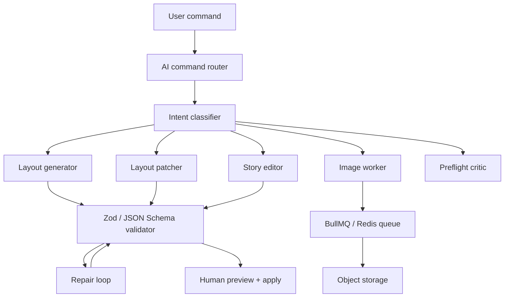

# AI Implementation Research for OpenDTP Studio

This document defines how OpenDTP Studio should implement LLM-driven layout generation, text editing, design instructions, image workflows, and production guardrails.

## Sources Reviewed

- OpenAI Responses API: text/image inputs, structured JSON, tools, function calling, conversation state.
- OpenAI Structured Outputs: schema-constrained responses for layout JSON.
- OpenAI Image Generation: GPT Image generation/editing through Image API or Responses image tool.
- Anthropic Messages API: text and image input messages.
- Anthropic Structured Outputs: JSON outputs and strict tool-use schemas.
- Anthropic Tool Use: schema-constrained tool calls.
- Anthropic Vision: multimodal image analysis.
- BullMQ: Redis-backed open source job queues.
- Yjs: open source CRDT collaboration layer.

## Core Product Principle

The AI must never directly mutate the document in an opaque way. Every AI action should produce one of these typed artifacts:

1. `LayoutDocument`: full validated layout JSON.
2. `LayoutPatch[]`: safe partial edits to frames/pages/styles/stories.
3. `StoryEdit`: revised text with tracked rationale.
4. `AssetGenerationJob`: queued request to create or edit an image.
5. `PreflightFixPlan`: suggested fixes for overset text, missing assets, bleed, or typography.

The app validates, previews, and applies these artifacts. This keeps AI magical to use but deterministic to ship.

## Recommended AI Architecture



## Model Routing

Use different model classes by task:

| Task | Best default | Cheap fallback | Notes |
|---|---|---|---|
| Full prompt-to-layout | Strong reasoning/text model with Structured Outputs | Mini text model | Needs schema conformance and design reasoning. |
| Layout patch commands | Fast structured-output model | Mini text model | Should return patches, not full documents. |
| Grammar/style edit | Fast text model | Mini text model | Preserve meaning, produce diff metadata. |
| Design critique | Strong reasoning model | Fast text model | Should explain preflight/design tradeoffs. |
| Image generation/editing | GPT Image model | Smaller image model | Use queue; image generation is slow/costly. |
| Image analysis/preflight | Vision-capable LLM | Traditional image tooling first | Prefer Sharp/metadata for DPI before LLM. |

## Prompt-to-Layout

Prompt-to-layout should be a two-stage process:

1. **Intent extraction**
   - Parse user language into: format, audience, publication type, page count, tone, density, color constraints, asset needs, typography direction, language, export target.
   - Output `LayoutBrief`.

2. **Layout synthesis**
   - Convert `LayoutBrief` into `LayoutDocument`.
   - Validate with Zod.
   - Run preflight.
   - If invalid, run repair with the validation errors and original brief.

### LayoutBrief Schema

```ts
type LayoutBrief = {
  publicationType: "flyer" | "magazine" | "booklet" | "poster" | "report" | "custom";
  title: string;
  audience: string;
  tone: string;
  pagePreset: "A4" | "Letter" | "Square" | "Custom";
  pageCount: number;
  columns: number;
  density: "airy" | "balanced" | "dense";
  needsBleed: boolean;
  colorIntent: "print-cmyk" | "digital-rgb" | "soft-proof";
  assetRequests: Array<{
    kind: "photo" | "illustration" | "chart" | "icon" | "placeholder";
    prompt: string;
    placement: "hero" | "inline" | "background" | "cover";
  }>;
};
```

## Natural Language Layout Editing

Never ask the model to return the whole document for small edits. Use patch operations:

```ts
type LayoutPatch =
  | { op: "set_frame_geometry"; frameId: string; xMm: number; yMm: number; widthMm: number; heightMm: number }
  | { op: "set_text_columns"; frameId: string; columns: number; columnGapMm: number }
  | { op: "set_page_bleed"; bleedMm: number }
  | { op: "replace_story"; storyId: string; content: string }
  | { op: "set_typography"; fontFamily?: string; baseSizePt?: number; leading?: number };
```

The API should:

1. Classify the instruction.
2. Generate patches with structured output.
3. Apply patches in deterministic code.
4. Validate the resulting document.
5. Return before/after preflight.

Example commands:

- “Make this denser and more like an academic journal.”
- “Move the image to the top and make body copy three columns.”
- “Add print bleed and warn me if anything touches trim.”
- “Make the headline feel more luxury but keep the body readable.”

## Text Generation and Editing

Text editing should not be a generic chat endpoint. It should be tied to story objects and produce metadata:

```ts
type StoryEdit = {
  storyId: string;
  originalTextHash: string;
  revisedText: string;
  editMode: "grammar" | "shorten" | "expand" | "tone" | "headline" | "caption" | "translate";
  summary: string;
  riskFlags: string[];
};
```

Recommended operations:

- Grammar correction.
- Tone shift.
- Shorten to fit frame capacity.
- Expand to target word count.
- Generate headlines/subheads/captions.
- Translate while preserving layout constraints.
- Rewrite for audience level.

Important DTP-specific context:

- Include target frame capacity.
- Include current overset state.
- Include style/tone guide.
- Include language and locale.
- Ask for a revised text length target, not just “make shorter.”

## Image Generation and Editing

Image generation should be asynchronous. The UI creates an image job, the worker generates/edits the image, stores it, then updates the frame asset.

```ts
type AssetGenerationJob = {
  id: string;
  documentId: string;
  frameId: string;
  kind: "generate" | "edit" | "variation";
  prompt: string;
  referenceAssetIds: string[];
  maskAssetId?: string;
  output: {
    width: number;
    height: number;
    format: "png" | "jpeg" | "webp";
    transparentBackground: boolean;
  };
};
```

Use cases:

- Generate placeholder-to-final editorial images.
- Edit a supplied image with a mask.
- Generate transparent cutouts for compositing.
- Create visual variations.
- Analyze uploaded images for caption suggestions.

Limitations to design around:

- Generated images are not precise layout engines.
- Do not rely on image models to place exact text or print marks.
- For product/brand assets, require user approval before replacing source images.
- Always store prompt, model, seed/config, and source references for auditability.

## Multimodal Image Analysis

Vision models should analyze images, not replace deterministic prepress tools.

Use deterministic tools first:

- Sharp/image metadata for dimensions.
- DPI calculation from placed size.
- Color profile extraction where available.
- File format and compression checks.

Use LLM vision for:

- Alt text.
- Caption drafts.
- Visual quality critique.
- Detecting whether an image matches the brief.
- Explaining why an image feels off-brand.

## Repair Loop

Every structured AI endpoint should follow this loop:

1. Call model with schema.
2. Parse response.
3. Validate with Zod.
4. If invalid, call repair prompt with:
   - original user request
   - invalid JSON
   - validation errors
   - strict instruction to return only corrected JSON
5. Validate again.
6. If still invalid, fall back to deterministic local behavior and log failure.

## Prompt Templates

### System Prompt for Layout Generation

```text
You are OpenDTP Studio's layout planner. Return only valid JSON matching the provided schema.
Design for printable editorial documents. Use millimeters. Preserve text readability.
Do not invent unsupported features. Put uncertainty in preflight warnings.
Never output markdown.
```

### User Prompt Envelope

```json
{
  "task": "generate_layout",
  "user_prompt": "...",
  "document_constraints": {
    "supported_page_sizes": ["A4", "Letter", "Square"],
    "supported_color_modes": ["rgb", "cmyk-soft-proof"],
    "max_pages": 12,
    "min_font_size_pt": 6
  },
  "brand_context": {},
  "existing_assets": []
}
```

### System Prompt for Text Fit

```text
You edit text for a desktop publishing layout. Preserve meaning and facts.
Target the requested character count because the copy must fit a fixed text frame.
Return structured JSON with revisedText, summary, and riskFlags.
```

## Provider Abstraction

Implement an internal provider interface:

```ts
interface AiProvider {
  generateLayoutBrief(input: LayoutPromptInput): Promise<LayoutBrief>;
  generateLayout(input: LayoutBrief): Promise<LayoutDocument>;
  generateLayoutPatches(input: LayoutPatchInput): Promise<LayoutPatch[]>;
  editStory(input: StoryEditInput): Promise<StoryEdit>;
  critiqueLayout(input: LayoutDocument): Promise<PreflightFixPlan>;
  generateImage(input: AssetGenerationJob): Promise<GeneratedAsset>;
}
```

Providers:

- `OpenAiProvider`
- `AnthropicProvider`
- `LocalFallbackProvider`

The rest of the app should never call vendor SDKs directly.

## Storage and Audit Requirements

Store these fields for every AI run:

- provider
- model
- endpoint/task
- prompt version
- input hash
- output hash
- validation result
- token usage/cost estimate when available
- latency
- user/document IDs
- approval status

This enables debugging, cost control, and compliance.

## Safety and Product Guardrails

- Validate all AI output before applying.
- Require preview before destructive document-wide changes.
- Keep undo/redo history for every AI patch.
- Flag hallucinated facts in generated copy as `riskFlags`.
- Never generate final legal/medical/financial copy without user review.
- Moderate user prompts and generated image/text where required by provider policy.
- Maintain asset provenance.

## Implementation Order

1. Replace direct OpenAI calls with `AiProvider`.
2. Add `LayoutBrief`, `LayoutPatch`, `StoryEdit`, and `AssetGenerationJob` schemas to `dtp-core`.
3. Implement OpenAI structured outputs for layout and text.
4. Add repair loop.
5. Add Anthropic provider for text/layout fallback.
6. Add image job queue and image generation endpoint.
7. Add image upload and asset library.
8. Add AI run audit table.
9. Add UI review/apply flow for patches.
10. Add prompt/version eval suite.
