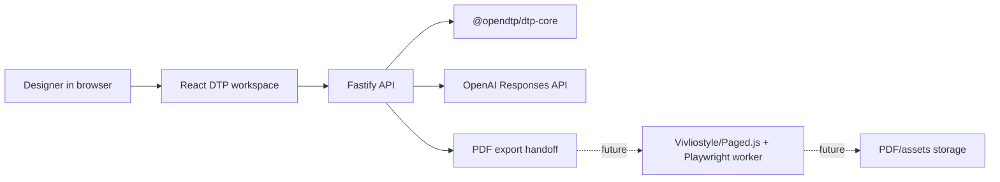

# Architecture

## Shape

OpenDTP Studio 1.0 is a modular monolith. The deployment is one Railway web service, but code boundaries already match the future service split.

## Core Contract

`@opendtp/dtp-core` owns the layout schema. All AI output, API input, and UI rendering passes through this contract:

- page size in millimeters
- bleed and margin metadata
- color mode
- typography settings
- stories
- pages
- text and image frames
- preflight warnings

The schema is intentionally explicit so AI output can be validated and repaired.

## Rendering Strategy

The browser preview renders fixed-size pages and absolutely positioned frames. Text frames use CSS multicolumn layout for dynamic flow inside the frame. This is sufficient for MVP editing and immediate visual feedback.

Version 1.0 includes synchronous PDF export from layout JSON through a Node PDF renderer. Professional export should still move to a worker because pagination, font loading, and PDF/X generation are CPU and memory heavy. The worker should render canonical HTML/CSS from the layout JSON, run Vivliostyle or Paged.js for paged media, and emit the final PDF through Playwright/Chromium or a dedicated PDF engine.

## AI Strategy

The API tries OpenAI only when `OPENAI_API_KEY` exists. Otherwise it uses a deterministic fallback generator. This keeps the product demoable, testable, and deployable without secrets.

Production AI should add:

- strict JSON schema generation
- retry and repair loops
- prompt/version logging
- model routing by task
- rate limiting
- usage accounting

## Deployment

Railway runs the root Dockerfile. The container builds all packages, serves `apps/web/dist`, and exposes the Fastify API on `PORT`.

Future high-scale deployment should use separate Railway services:

- `web-api`: lightweight HTTP, auth, projects
- `export-worker`: CPU-heavy PDF generation
- `ai-worker`: prompt orchestration and batch edits
- PostgreSQL: documents and version metadata
- object storage: assets, fonts, PDFs
