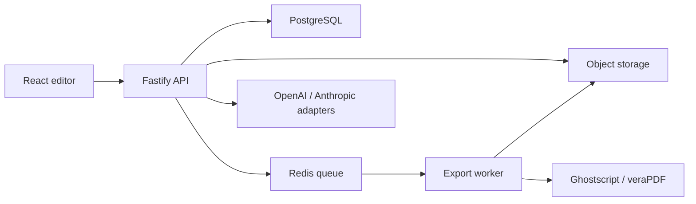

# Professional Product Roadmap

This roadmap turns OpenDTP Studio from a strong publishing foundation into a professional browser DTP platform.

Detailed open-source research lives in [OpenDTP Research Labs](./labs/README.md).

## Phase 1: Durable Documents and Direct Editing

Status: implemented as the first production foundation.

- Document CRUD API: implemented.
- Local filesystem store for development and Railway demos: implemented.
- PostgreSQL-ready repository boundary.
- Direct frame drag/resize in the browser: implemented with `react-rnd`.
- Save/load/new document UX: implemented.
- Existing preflight and PDF export preserved and routed through export jobs.

Open source acceleration:

- `react-rnd` for mature drag/resize primitives.
- Zod for layout validation.
- Fastify ecosystem for production API behavior.

## Phase 2: Professional Document Model

- Multi-page documents.
- Multi-page documents: first implementation complete via linked page creation.
- Spreads and master pages.
- Linked text frames across pages.
- Linked text frames across pages: first story-linking foundation implemented.
- Paragraph, character, and object styles.
- Layers, locking, visibility, z-order.
- Guides, rulers, snapping, and baseline grid.
- Exact overset detection through a pagination service.

Open source candidates:

- Paged.js or Vivliostyle for paged media behavior.
- Hypher or `hyphenopoly` for hyphenation.
- Yjs for collaborative document state once single-user editing is stable.

## Phase 3: Asset and Font Pipeline

- Image uploads and asset library.
- Image uploads and asset library: foundation implemented with local storage and Sharp metadata.
- DPI checks: first asset-aware preflight implemented.
- Font upload/catalog.
- Font subsetting and embedding.
- Missing font and missing asset recovery.
- Optional S3-compatible object storage.

Open source candidates:

- Sharp for image inspection and transforms.
- Fontkit for font metadata/subsetting support.
- MinIO/S3-compatible storage for deployment portability.

## Phase 4: Export Worker and PDF/X

- Move PDF rendering out of the web API.
- Queue export jobs with retries.
- Generate print marks.
- Support ICC profiles and PDF/X validation.
- Store generated PDFs as artifacts.

Open source candidates:

- BullMQ with Redis for background jobs.
- Vivliostyle/Paged.js with Playwright for paged HTML rendering.
- Ghostscript and veraPDF for validation.

## Phase 5: Accounts, Collaboration, and Teams

- Auth and user accounts.
- Project/team permissions.
- Autosave and version history.
- Comments and review mode.
- Real-time collaboration.

Open source candidates:

- Lucia/Auth.js or custom OAuth integration.
- Yjs with WebSocket provider for collaborative state.
- PostgreSQL row-level ownership model.

## Phase 6: AI as a Production Feature

- Strict schema outputs and repair loops.
- Prompt-to-template and brand-aware generation.
- Layout critique and automated preflight fixes.
- Cost tracking, rate limits, and model routing.
- Prompt/version audit log.

## Phase 7: Productization

- Template gallery.
- Onboarding and example documents.
- Hosted docs.
- Contribution guide and governance.
- Accessibility and visual regression suite.
- Load testing and observability.

## Target Deployment Architecture

The current monolith remains useful while the product grows. Each phase extracts one professional concern behind an interface before splitting services.
